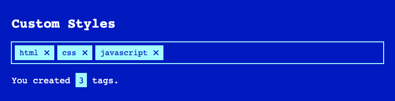

# Tag Input

[](https://www.npmjs.com/package/@accessible-components/tag-input)
[](https://github.com/accessible-components/tag-input/blob/master/LICENSE.md)
[](https://www.w3.org/WAI/WCAG21/quickref/)


Simple and accessible component for creating tags. Check out a [demo page](https://tag-input.netlify.app/).

## Features

* Tags can be added both manually and dynamically.
* Fully accessible for keyboard and assistive technologies.
* Cusomisable styles.


## Browser support

All modern browsers. _IE11_ is not supported.

### Tested in

| OS | Browser | Screen reader |
| -- | ------- | ------------- |
| macOS | Safari | VoiceOver |
| iOS | Safari | VoiceOver |
| Windows | Chrome | JAWS |
| Windows | Firefox | NVDA |
| Android | Chrome | Talkback |

## Installation

### `npm`

```
npm install @accessible-components/tag-input
```

Then import `build/tag-input.min.js` and `build/tag-input.min.css` from `node_modules`.

### Static sites

Copy `build/tag-input.min.js` and `build/tag-input.min.css` to your project and include them in your HTML:

```html
<link rel="stylesheet" href="./path/to/file/tag-input.min.css" />
...
<script src="./path/to/file/tag-input.min.js"></script>
```

### Locally

```
git clone https://github.com/accessible-components/tag-input.git
cd tag-input/
npm install
npm start
```

Open http://localhost:8080/ in your browser to open the demo page.

## Keyboard support

Once focused on the input field, following keyboard shortcuts are available:

| Shortcut | Input field | Tag selected | Action |
| -------- | ----------- | ------------ | ------ |
| `ArrowLeft`, `ArrowRight` | Empty | - | Navigate through tags if they exist. Selected tag is visually highlighted as well as anounced for screen reader users.  |
| `Delete` | Empty | No | Deletes the last tag. |
| `Enter` | Empty | Yes | Makes selected tag editable. |
| `ESC` | Empty | Yes | Resets edited tag (before it saved) to the prevous state. |
| `Enter`, `Tab` | Filled | No | Creates a new tag. |

### Some thoughts to `Backspace` key

Although, many similar tag input components use `Backspace` key for deleting tags (if an input field is empty), after testing `TagInput` with blind users we decided not to support this shortcut because of following reasons:

* Many screen reader users once focused on the input field want to be sure that it's empty (often some sample text is already prefilled). For that instead of reading the content they simply delete it with `Backspace` key, so using this key for other actions may confuse screen reader users.

* Some of the blind testers used devices with so called _Perkins Style Braille Keyboard_ where `SwipeLeft` triggers `Backspace`, wich may cause unexpected behaviour.

For deleting tags use `Delete` key.

## Accessibility

`TagInput` is fully accessible for a keyboard, screen readers and other assistive technologies. It was tested by people who use these technologies on everyday basis.

## Usage

Create an empty element:

```html
<div id="colors"></div>
```

Create `TagInput` instance:

```js
const colors = document.getElementById('colors');

const colorsTagInput = new TagInput(colors, {
  tags: ['red', 'green', 'blue'],
  label: 'Colors',
  placeholder: 'Add colors',
  // other options

  onTagAdd: (tag, tags) => {
    // do something
  },
  onTagRemove: (tag, tags) => {
    // do something
  },
  onTagUpdate: (oldTag, newTag, tags) => {
    // do something
  },
});
```

### Custom styles

You can easily adjust `TagInput` styles.



To change colors you can simply update following CSS custom variables:

```css
.tag-input {
  /* input */
  --text: inherit;
  --bg: #fff;
  --bg-disabled: #f9f9f9;
  --border: rgba(121, 121, 121, 0.23);
  --border-hover: rgba(121, 121, 121, 0.4);
  --border-focus: rgba(45, 146, 255, 0.7);
  --border-focus-light: rgba(190, 221, 255, 0.5);

  /* tag */
  --tag-text: #164172;
  --tag-bg: #e5f1ff;
  --tag-border: #e5f1ff;
  --tag-remove-button: transparent;
  --tag-remove-icon: #2e91fd;

  ...
}
```

> See all CSS properties in `tag-input.css`.

To update other styles (`paddings`, `margins` etc.), you may simply override css styles. `TagInput` has following HTML structure:

```html
<div class="tag-input-container">
  <label class="tag-input-label">Colors</label>
  <div class="tag-input">
    <div class="tag-input__tag">
      <span class="tag-input__text">red</span> <!-- Shown -->
      <input class="tag-input__edit" /> <!-- Hidden -->
      <button class="tag-input__remove">
        <svg class="tag-input__remove-icon">...</svg>
      </button>
    </div>
    <div class="tag-input__tag tag-input__tag--editable">
      <span class="tag-input__text">green</span> <!-- Hidden -->
      <input class="tag-input__edit" /> <!-- Shown -->
      <button class="tag-input__remove">
        <svg class="tag-input__remove-icon">...</svg>
      </button>
    </div>
    <div class="tag-input__tag">
      <span class="tag-input__text">blue</span> <!-- Shown -->
      <input class="tag-input__edit" /> <!-- Hidden -->
      <button class="tag-input__remove">
        <svg class="tag-input__remove-icon">...</svg>
      </button>
    </div>
    <input class="tag-input__input" placeholder="Add colors" />
  </div>
</div>
```

## Options

| Option | Type | Default | Description |
| ------ | ---- | ------- | ----------- |
| **tags** | `String[]` | `[]` | Tags provided on initialization. |
| **prefix** | `Type` | `tag-input` | Unique prefix for class names and IDs inside the component. |
| **disabled** | `Boolean` | `false` | `disabled` attribute for the input element. Also makes tags not editable. |
| **name** | `String` | `tag-input` | `name` atribute for the input field to be accessed on form submit. |
| **placeholder** | `String` | `Add tags` | `placeholder` attribute for the input element. |
| **label** | `String` | `Tags` | Label text. |
| **hiddenLabel** | `Boolean` | `false` | Hides the label visually, but keeps it accessible for screen readers. |
| **onInit** | `Function` | `undefined` | Runs after tag input init. Parameters: `tags` (list of tags). |
| **onTagAdd** | `Function` | `undefined` | Runs after a new tag was added. Parameters: `tag` (added tag), `tags` (list of tags after adding). |
| **onTagUpdate** | `Function` | `undefined` | Runs after a tag was updated. Parameters: `oldTag` (a tag before update), `newTag` (a tag after update), `tags` (list of tags after updating). |
| **onTagRemove** | `Function` | `undefined` | Runs after a tag was removed. Parameters: `tag` (removed tag), `tags` (list of tags after removing). |
| **ariaTag** | `String` | `Tag {{TAG}}.` | Adds `aria-label` to the tag element. |
| **ariaEditTag** | `String` | `Edit tag.` | Adds label text to the editable tag. |
| **ariaDeleteTag** | `String` | `Delete tag {{TAG}}.` | Adds `aria-label` to the tag delete button. |
| **ariaTagAdded** | `String` | `Tag {{TAG}} added.` | Will be pronounced to screen reader users after a new tag was created. |
| **ariaTagUpdated** | `String` | `Tag updated to {{TAG}}.` | Will be pronounced to screen reader users after a tag was updated. |
| **ariaTagDeleted** | `String` | `Tag {{TAG}} deleted.` | Will be pronounced to screen reader users after a tag was deleted. |
| **ariaTagSelected** | `String` | `Tag {{TAG}} selected. Press enter to edit, delete to delete.` | Will be pronounced to screen reader users after a tag was selected (by bavigating with arrow keys). |
| **ariaNoTagsSelected** | `String` | `No tags selected.` | Will be pronounced to screen reader users after a selected tag was unselected (by clicking on ESC key, for example). |
| **ariaInputLabel** | `String` | `{{TAGS}} tags. Use left and right arrow keys to navigate, enter or tab to create, delete to delete tags.` | Will be pronounced to screen reader users once the input element is focused. |

> Options with prefix `aria` add ARIA attributes to some elements with instructions and other valueable info for screen reader users. ARIA text is not visible.

> Please keep placeholder text such as `{{TAG}}` or `{{TAGS}}` as it is. It will be replaced with proper text.

## Methods

| Method | Argument | Return | Description |
| ------ | ----------- | -------- | ------ |
| **addTag** | `String` | `undefined` | Adds a new tag. No duplicates allowed. |
| **removeTag** | `String` | `undefined` | Removes a tag if it exists. |
| **getTags** | - | `String[]` | Gets the tag array. |

## Contributing

Everyone is welcome to contribute.

* If you found a bug or have an idea how to improve the component, please submit an [issue](https://github.com/accessible-components/tag-input/issues).
* You may test our component on different devices and give us your feedback.

## Ideas for the next features

* Min/max tags specified vis options.
* Custom tag validation before `addTag`
* Tag autocomplete
* Custome _remove tag_ icon provided via options.
* Translate ARIA and other text and provide downloadable JSON files with translations.

## License

[MIT](LICENSE.md)
